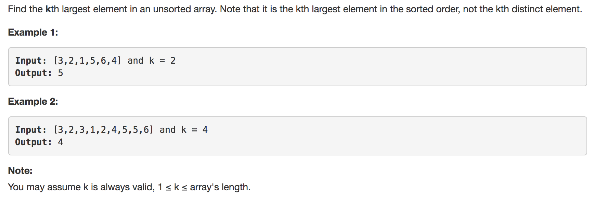
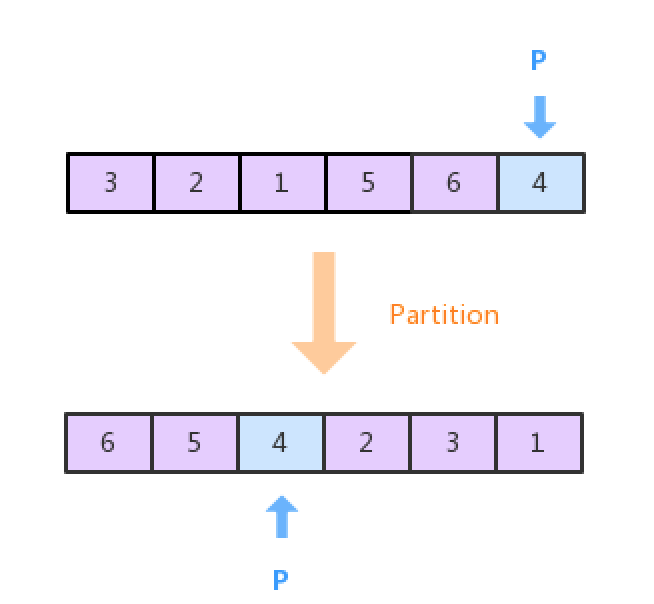
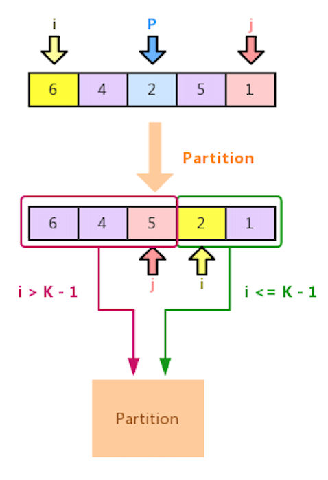

# [215.Kth Largest Element in an Array](https://leetcode.com/problems/kth-largest-element-in-an-array/)

# 题目



## 分析

- 方法1：利用排序算法保证序列是降序，取第K个数即可
- 方法2：不一定需要完全排序，只需要保证第K个数的左边的数都大于它，右边的数小于它。每次切分完后只需找K所在的那部分继续切分即可，减少不必要的切分。

## 方法1

使用降序的快排，然后取第K个数

```java
class Solution {
    public int findKthLargest(int[] nums, int k) {
		quickSort(nums, 0, nums.length - 1, k - 1);
		return nums[k-1];
	}
	
	public static void quickSort(int[] arr, int l, int h, int k) {
		if (l >= h) return;
		int j = partition(arr, l, h);
		if (j == k) return;
		quickSort(arr, l, j - 1, k);
		quickSort(arr, j + 1, h, k);
	}

	public static int partition(int[] arr, int l, int h) {
		int lo = l - 1;
		int hi = h;
		int v = arr[h];
		
		while (true) {
			while (arr[++lo] > v) {
				if (lo == h) break;
			}
			while (arr[--hi] < v) {
				if (hi == l) break;
			}
			if (lo >= hi) break;
			swap(arr, lo, hi);
		}

		swap(arr, h, lo);
		return lo;
		
	}
	
	public static void swap(int[] arr, int i, int j) {
		int tmp = arr[i];
		arr[i] = arr[j];
		arr[j] = tmp;
	}
}
```

## 方法2

快排(降序)的思想就是保证每次切分得到的数组都满足基准数右边的数都大于基准数，左边的数都小于基准数，如下图所示



快速排序进行每次切分后，还需要继续对基准点左右两边继续进行切分。为了减少切分的次数，算法只对包含K的部分进行继续切分。同时切分点的选择会影响着算法的效率，如果将中间点作为切分点那会大大的减少时间复杂度(Time Complexity O(n)来自于O(n) + O(n/2) + O(n/4) + ... ~ O(2n))。



```java
class Solution {
    public int findKthLargest(int[] nums, int k) {
       quickSort(nums, 0, nums.length - 1, k);
        return nums[k-1];
    }

    private void quickSort(int[] nums, int start, int end, int k) {
        if (start >= end) return;
        int i = start;
        int j = end;
        int mid = (end - start) / 2 + start;
        int pivot = nums[mid];
        while (i <= j) {
            while (i <= j && nums[i] > pivot) {
                i ++;
            }
            while (i <= j && nums[j] < pivot) {
                j --;
            }
            if (i <= j) {
                int tmp = nums[i];
                nums[i] = nums[j];
                nums[j] = tmp;
                i ++;
                j --;
            }
        }
        if(i > k - 1){
            quickSort(nums, start, j, k);
        } else {
            quickSort(nums, i, end, k);
        }

    }
}
```

