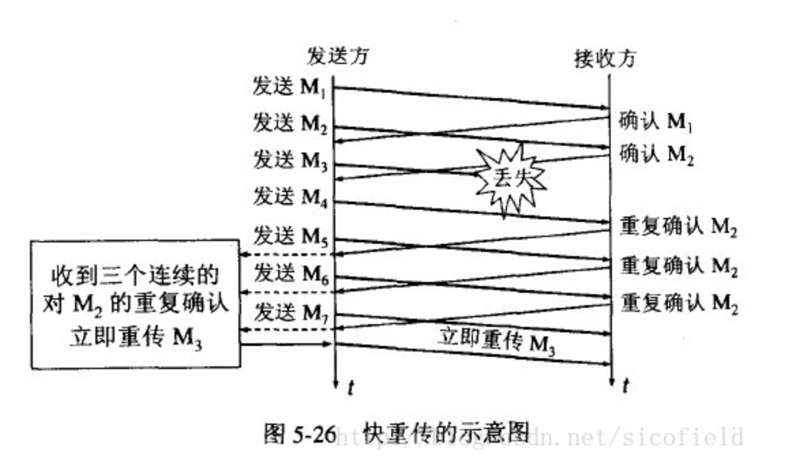
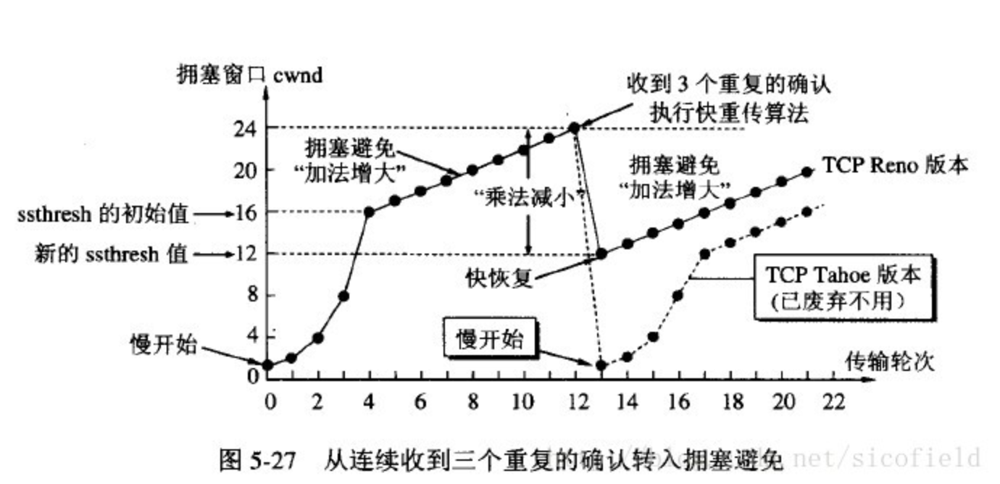
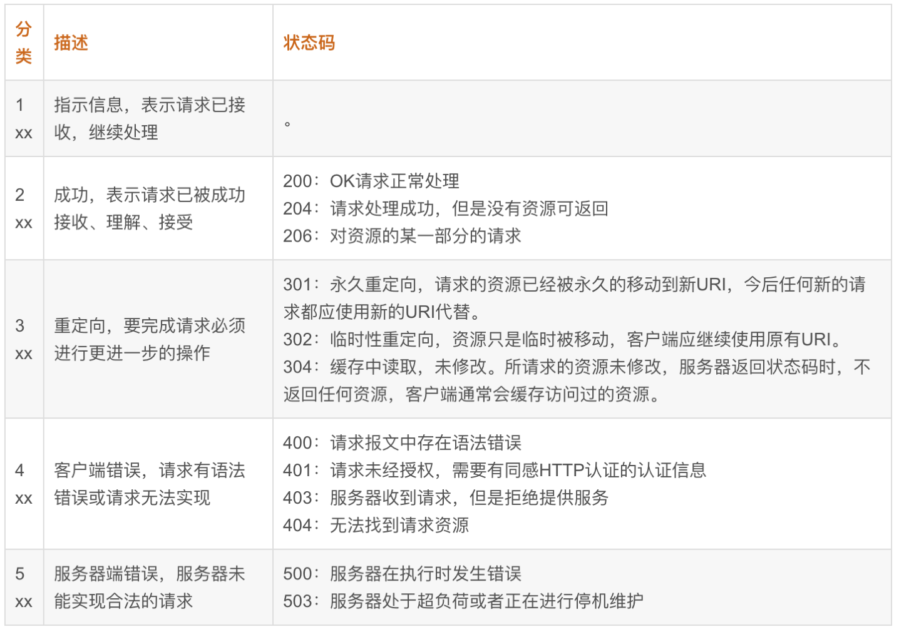
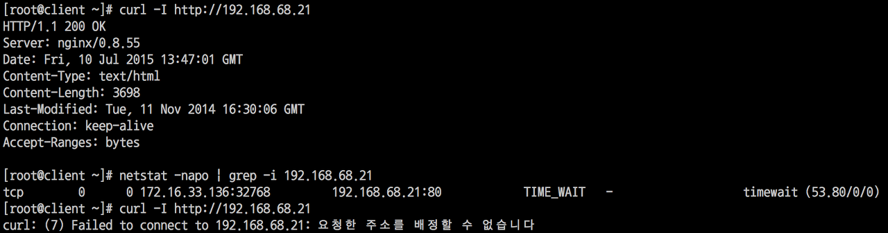
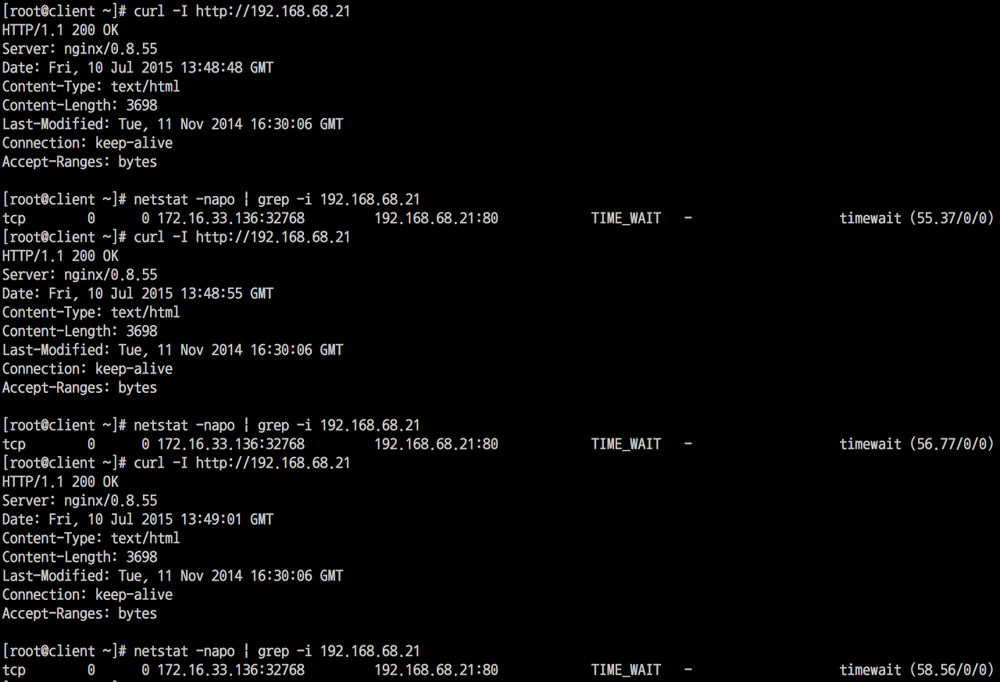

## TCP四次握手 

这部分主要是对四次握手过程中的疑问进行记录。

#### 如果在 LAST_ACK 状态没收到对方的 ack 信号怎么办？

> B 发送 FIN，进入 LAST_ACK 状态，A 收到这个 FIN 包后发送 ACK 包，由于某种原因，这个 ACK 包丢失了，B 没有收到 ACK 怎么办？

 这种情况下，B 等待 ACK 包超时，则又会向 A 发送了一个 FIN 包。 

- 假如这个时候，A 还处于 TIME_WAIT 状态(也就是在 TIME_WAIT 持续的时间 2MSL 内，收到了) A 收到这个 FIN 包，则A向 B 发送了一个 ACK 包，B 收到这个 ACK 包进入 CLOSED 状态 。

- 假如这个时候，A已经从TIME_WAIT状态变成了CLOSED状态A收到这个FIN包后，认为这是一个错误的连接，向B发送一个RST包，当B收到这个RST包，进入CLOSED状态 。

- 假如这个时候，A挂了（假如这台机器炸掉了），B没有收到A的回应，那么会继续发送FIN包，也就是触发了TCP的重传机制，如果A还是没有回应，B还会继续发送FIN包，直到重传超时(至于这个时间是多长需要仔细研究)，B重置 。


## TCP滑窗机制

1. 作用
   + 提供TCP可靠性；
   + 提供TCP的流控特性。

2. 相关参数
   + 16bits表示窗口大小；
   + option-kind表示窗口的扩大因子。

3. 发送端状态
   + 已经发送并得到对方ACK；
   + 已经发送还未收到ACK；
   + 未发送但对方运行发送；
   + 未发送且对方不允许发送。

4. 接收端状态
   + 已接收；
   + 未接收准备收；
   + 未接收并未准备接收。

5. 工作流程

   + 移动的条件：

     只有收到对方发送的ACK确认，才会移动窗口的左边界。

   + 窗口调整方式：
     + 满开始；
     + 拥堵避免；
     + 快速重传；
     + 快速回复。


## TCP拥塞控制

- 拥塞判断
  - TCP发生了RTO重传，认为网络发生拥塞。
- 慢开始和拥塞避免
  - 慢开始
    - 避免立即使用较大的窗口进行数据的传输，导致堵塞。该方法会从小到大逐渐增大发送端的拥塞窗口数值
    - 先将拥塞窗口cwnd设置为一个MSS的大小（即窗口大小设置为1）
    - 每收到一个确认后cwnd就扩大一倍(1, 1 + 1, 2 + 2, 4 + 4)
  - 拥塞避免
    - 当窗口大小到达门限值ssthresh，启用拥塞避免
    - 拥塞避免的主要思想是加法增大，也就是cwnd的值不再指数级往上升，开始加法增加。
    - 此时当窗口中所有的报文段都被确认时，cwnd的大小加1，cwnd的值就随着RTT开始线性增加，这样就可以避免增长过快导致网络拥塞，慢慢的增加调整到网络的最佳值。
  - 为了防止cwnd增长过大引起网络拥塞，还需设置一个慢开始门限ssthresh状态变量。
    - **当cwnd<ssthresh时，使用慢开始算法。**
    - **当cwnd>ssthresh时，改用拥塞避免算法。**
    - **当cwnd=ssthresh时，慢开始与拥塞避免算法任意。**
  - 当网络发生拥塞时
    - 把ssthresh降低为cwnd值的一半
    - 把cwnd重新设置为1
    - 重新进入慢启动过程
  - 过程图


- 快重传和快恢复
  - 快重传

    - 如果发送方一连收到 3 个重复的确认，就应当立即传送对方未收到的报文 M3，而不必等待 M3 的重传计时器到期。

  - 快恢复
    - 当发送方连续收到三个重复确认时，就执行“乘法减小”算法，把ssthresh门限减半。但是接下去并不执行慢开始算法。
    - 此时不执行慢开始算法，而是将cwnd设置为ssthresh的大小，然后执行拥塞避免算法

  - 过程图

    

    


## 一些名词解释 

- MSL：即“报文最大生存时间”，他是任何报文在网络上存在的最长时间，超过这个时间报文将被丢弃。The TCP standard defines MSL as being a value of 120 seconds 

- RTT：是客户到服务器往返所花时间（round-trip time，简称RTT）

  - 链路的传播时间（propagation delay）
  - 末端系统的处理时间
  - 路由器缓存中的排队和处理时间（queuing delay）

- RTO（Retransmission TimeOut）即重传超时时间。

  - 经典的算法 RFC793
  - Jacobaon/Karels 算法
- cwnd（congestion window size）：拥塞窗口大小（能装多少个MSS）
- HTTP METHOD

  - GET: 获取接口信息，form只支持get和post
  - POST： 提交数据
  - PUT： 支持幂等性的post。也就是说同一个请求因服务器或者传输发生异常发生重传时，最终保证只有唯一一条数据被写入——幂等性。
  - DELETE：删除服务器上的资源
  - HEAD：查看HTTP的头部，看看支持什么方法，数据类型是什么，大小是什么

  - OPTIONS：查看支持的HTTP方法

- Http code

1. 1. 301和302

   2. 301为永久性的跳转，而302为临时性的跳转。永久性体现在之前的连接不再存在。

      

      >  301 Moved Permanently 被请求的资源已永久移动到新位置，并且将来任何对此资源的引用都应该使用本响应返回的若干个URI之一。如果可能，拥有链接编辑功能的客户端应当自动把请求的地址修改为从服务器反馈回来的地址。除非额外指定，否则这个响应也是可缓存的。

      > 302 Found 请求的资源现在临时从不同的URI响应请求。由于这样的重定向是临时的，客户端应当继续向原有地址发送以后的请求。只有在Cache-Control或Expires中进行了指定的情况下，这个响应才是可缓存的。


## TIME_WAIT太多怎么处理

#### 1. TIME_WAIT的作用

- 保证最后一个ACK能够正常的被发出

  如果主动关闭的client端直接进入CLOSED状态，那么被动关闭的server会接受到RST异常，认为对方出现了异常。因此client收到server发送的FIN后，应该进入TIME_WAIT状态并向对方发送ACK，使server能够顺利的进入CLOSED状态。

- 避免网络残留的数据包会污染到下一次TCP传输

  若没有TIME_WAIT的状态，server和client都同时进入CLOSED状态，那么在下一次相同IP和端口的TCP连接中，可能会接收到上一段TCP连接所残留的数据信息。因此，TIME_WAIT需要等待2MSL，使得残余的数据能够被处理（MSL是用来确认一个数据报在网络中单向发送到认定丢失的时间，2倍MSL意义在于计算丢失报文的发送到响应丢失所需要的总时间）

#### 2. 大量TIME_WAIT出现并且需要解决的场景
在高并发短连接的TCP服务器上，当服务器处理完请求后立刻按照主动正常关闭连接。。。这个场景下，会出现大量socket处于TIMEWAIT状态。如果客户端的并发量持续很高，此时部分客户端就会显示连接不上。

- 高并发：大量端口被同时占用

- 短连接：传输的总时间小于TIME_WAIT等待时间，造成端口被低效的占用

#### 3. 如何处理？

不像Windows 可以修改注册表修改2MSL 的值，linux （默认的MSL值（60s））是没有办法修改MSL的，tcp_fin_timeout 不是2MSL 而是Fin-WAIT-2状态.

在sysctl修改改两个内核参数就行了，如下：

```shell
net.ipv4.tcp_tw_reuse = 1 # Enable fast recycling TIME-WAIT sockets
						  # 同一IP和端口的TCP连接能够在TIME_WAIT状态下被复用

# net.ipv4.tcp_tw_recycle = 1 # !!!(has been removed from Linux 4.1).
							  # 60秒内同一个IP建立2个连接的话，
							  # 后面一个SYN连接的时间戳必须大于之前的SYN里面的TSVal，
							  # 否则服务器会认为这是一个老连接的数据包，忽略它。

# 客户端和服务端timestamps 都需要开启时才管用

```

#### 4.不使用的效果

处于TIME_WAIT状态下的同一个IP和端口不能够立即被重新使用



#### 5. tcp_tw_reuse的使用效果

即使处于TIME_WAIT状态，仍可以复用连接



#### Reference

- [TCP/IP详解--TCP连接中TIME_WAIT状态过多](https://blog.csdn.net/yusiguyuan/article/details/21445883)
- [tcp_tw_reuse、tcp_tw_recycle 使用场景及注意事项](https://www.cnblogs.com/lulu/p/4149312.html)
- [TCP TIME STAMP](http://perthcharles.github.io/2015/08/27/timestamp-intro/)
- [The difference with tcp_tw_recycle and tcp_tw_reuse](http://linuxsyseng.blogspot.com/2017/03/the-difference-with-tcptwrecycle-and.html)
- [RTO计算](https://blog.csdn.net/wdscq1234/article/details/52505191)
- [Coping with the TCP TIME-WAIT state on busy Linux servers](https://vincent.bernat.ch/en/blog/2014-tcp-time-wait-state-linux#netipv4tcp_tw_recycle)
