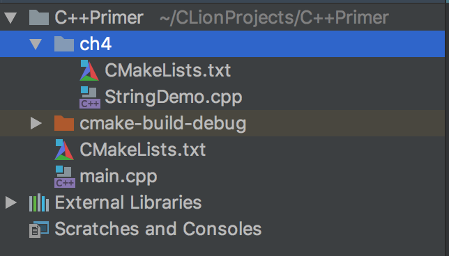
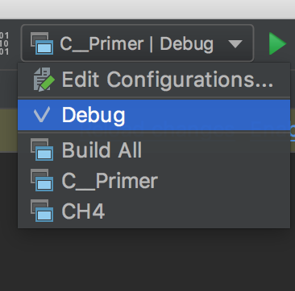

# 在CLion中使用CMake建立多工程目录

## 需求

在一个项目中，不同的目录下都有各自的运行主程序。目录如下图所示：



StringDemo的运行不会影响main的运行

## 配置CMakeLists.txt

1. 主工程下

   ```cmake
   # CMake 最低版本要求
   cmake_minimum_required(VERSION 3.10)
   
   # 项目信息
   project(C__Primer)
   
   # 设置C++的版本信息
   set(CMAKE_CXX_STANDARD 11)
   
   # 查找当前目录的所有源文件，并将名称保存到变量DIR_SRCS里
   aux_source_directory(. DIR_SRCS)
   
   # 指定生成目标
   add_executable(C__Primer ${DIR_SRCS})
   
   # 添加子目录
   add_subdirectory(ch4)
   
   ```


2. 子目录下

   ```cmake
   # 设置变量CH4_SRC
   SET(CH4_SRC StringDemo.cpp)
   
   # 指定生成目标
   add_executable(CH4 ${CH4_SRC})
   ```


## 重新加载CMake Project并编译运行


重载后编译的位置就会多了一个CH4的选项


